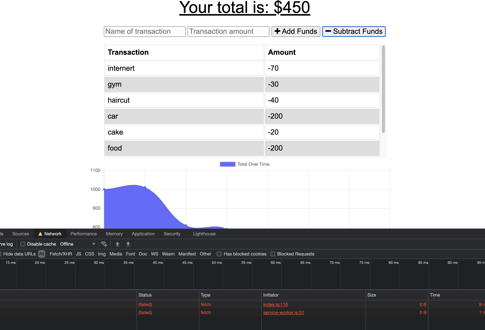

# Online/Offline Budget Trackers

In this application the user will be able to add expenses and deposits to their budget with or without a connection. When entering transactions offline, they populate the total when brought back online.

Offline Functionality:

  * Enter deposits offline

  * Enter expenses offline

When brought back online:

  * Offline entries are added to tracker.

## User Story
AS AN avid traveller
I WANT to be able to track my withdrawals and deposits with or without a data/internet connection
SO THAT my account balance is accurate when I am traveling

## Business Context

Giving users a fast and easy way to track their money is important, but allowing them to access that information anytime is even more important. Having offline functionality is paramount to our applications success.

## link to deplyed application 

* https://evening-cove-88610.herokuapp.com/